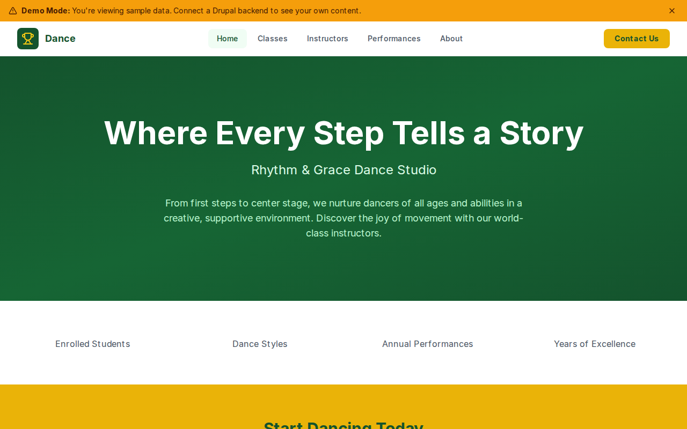

# Decoupled Dance

A dance studio website starter template for Decoupled Drupal + Next.js. Built for dance school owners, studio managers, and performing arts organizations.



## Features

- **Dance Classes** - Showcase class offerings with style, age group, level, and schedule details
- **Instructor Profiles** - Highlight your teaching staff with bios, specialties, and training backgrounds
- **Performances & Recitals** - Promote upcoming shows with dates, venues, ticket pricing, and links
- **Modern Design** - Clean, accessible UI optimized for dance studio and performing arts content

## Quick Start

### 1. Clone the template

```bash
npx degit nextagencyio/decoupled-dance my-dance-studio
cd my-dance-studio
npm install
```

### 2. Run interactive setup

```bash
npm run setup
```

This interactive script will:
- Authenticate with Decoupled.io (opens browser)
- Create a new Drupal space
- Wait for provisioning (~90 seconds)
- Configure your `.env.local` file
- Import sample content

### 3. Start development

```bash
npm run dev
```

Visit [http://localhost:3000](http://localhost:3000)

---

## Manual Setup

<details>
<summary>Click to expand manual setup steps</summary>

### Authenticate with Decoupled.io

```bash
npx decoupled-cli@latest auth login
```

### Create a Drupal space

```bash
npx decoupled-cli@latest spaces create "My Dance Studio"
```

Note the space ID returned. Wait ~90 seconds for provisioning.

### Configure environment

```bash
npx decoupled-cli@latest spaces env 1234 --write .env.local
```

### Import content

```bash
npm run setup-content
```

This imports:
- Homepage with hero section and studio statistics
- 3 dance classes (Classical Ballet, Hip Hop, Contemporary Dance)
- 3 instructor profiles (Adriana Russo, DeShawn Williams, Katrina Novak)
- 3 performances (Spring Showcase 2026, The Nutcracker 2026, Urban Moves Showcase)
- About page and Studio Policies page

</details>

## Content Types

### Dance Class
- **dance_style**: The style of dance (e.g., Ballet, Hip Hop, Contemporary)
- **age_group**: Target age range for the class
- **class_level**: Skill level (Beginner, Intermediate, Advanced, All Levels)
- **schedule**: Class meeting times and days
- **image**: Photo representing the class

### Instructor
- **dance_styles**: Styles the instructor teaches
- **email**: Contact email address
- **training_background**: Professional training and credentials
- **photo**: Instructor headshot

### Performance
- **performance_date**: Date and time of the performance
- **venue**: Performance location
- **ticket_price**: Ticket pricing information
- **ticket_url**: Link to purchase tickets
- **image**: Promotional image for the performance

## Customization

### Colors & Branding
Edit `tailwind.config.js` to customize colors, fonts, and spacing.

### Content Structure
Modify `data/dance-content.json` to add or change content types and sample content.

### Components
React components are in `app/components/`. Update them to match your design needs.

## Demo Mode

Demo mode allows you to showcase the application without connecting to a Drupal backend.

### Enable Demo Mode

```bash
NEXT_PUBLIC_DEMO_MODE=true
```

### Removing Demo Mode

1. Delete `lib/demo-mode.ts`
2. Delete `data/mock/` directory
3. Delete `app/components/DemoModeBanner.tsx`
4. Remove `DemoModeBanner` from `app/layout.tsx`
5. Remove demo mode checks from `app/api/graphql/route.ts`

## Deployment

### Vercel (Recommended)
[](https://vercel.com/new/clone?repository-url=https://github.com/nextagencyio/decoupled-dance)

### Other Platforms
Works with any Node.js hosting platform that supports Next.js.

## Documentation

- [Decoupled.io Docs](https://www.decoupled.io/docs)
- [Next.js Documentation](https://nextjs.org/docs)
- [Drupal GraphQL](https://www.decoupled.io/docs/graphql)

## License

MIT
